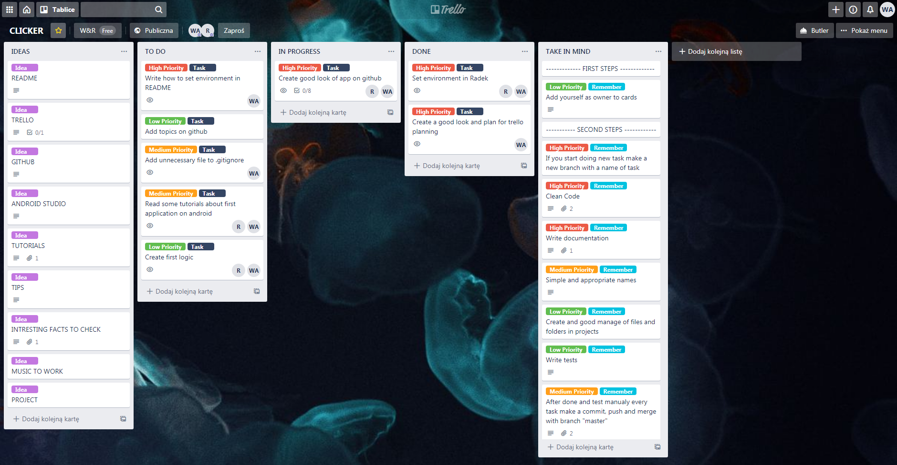

# Clicker

Clicker is a game in which by clicking on items we gain points, which can then spent on various improvements. The project is still develop.
The game was created and is still being developed, by two programmers, in order to learn how to create applications for mobile devices in the JAVA language.

## Topics
* [Goals](#goals)
* [Screenshots](#screenshots)
* [Tools](#tools)
* [Plans](#plan)
* [Setup](#setup)
* [Contact](#contact)

## Goals

#### The main goal of our project is to learn as much as possible about the logic of the android, its frameworks, Java syntax and of course creating an interesting application. 
##### The other goals: 
* Creating a clean and current application development [plan](#plan) as well as new ideas and their implementation
* Learn to use and plan your time in the most efficient way
* Creating an application that will be well written, efficient and secure
* Set appropriate tests for better fluidity when developing applications
* Writing understandable documentation to make work on the project as pleasant as possible

## Screenshots

```
IN PROGRESS
```

## Tools

* Java 14
* Android Studio
* Trello
* Gradle
* Git

## Plan

#### Short Todo: 

```
IN PROGRESS
```

#### We plan our project using the Trello website. Here is how our planning looks like:  



#### Also [here](https://trello.com/b/guU4PRcP/clicker) is our table on Trello

## Setup

1. Download: 
    - Android Studio or chosen text editor
    - Java Vritual Machine, you can also do it by your text editor (JDK)
    - App which allow you to connect computer with your phone by ADB
    - Git
2. Clone github repository
3. Open it by chosen text editor
4. Build project 
5. Chose how you want to test app 
6. Run application in emulator or your mobile phone

## Contact/Authors
  Feel free to contact us!
    * [Wojciech Adamowski](mailto:wojtekadam1@gmail.com)
    * [Radosław Żubrowski](mailto:radoslaw.zubrowski@gmail.com)

